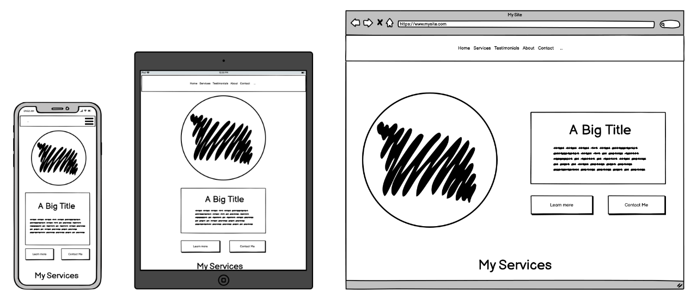

# Freelance Work Profile Website

The purpose of the site is to provide information about my freelance services to prospective clients and provide contact details to both new and returning customers.

I primarily cater to local businesses, freelancers and charities. My clients are usually looking for a locally-based developer to work with and aren't usually interested in many technical details.

The site will be designed to provide easily accessible, relevant information to my target audience. I will use a responsive, mobile-first design to ensure the site is effective and well laid out across a range of devices.

***

## User Experience

Most users of the site will be either prospective new clients or returning clients. 

### New Client User Stories

* As a prospective new client, I want to quickly and easily understand the services on offer so I can decide if they might meet my needs.
* As a prospective new client, I want to learn about the experiences of previous clients so I can determine if the service is reliable.
* As a prospective new client, I want to know how to request more information or hire the freelancer.
* As a prospective new client, I want to quickly be able to understand how to navigate the site to find the information I need.
* As a prospective new client, I want to learn more about the freelancer so I know who I might be working with.

### Returning Client User Stories

* As a returning client, I want to quickly find information on services offered.
* As a returning client, I want to be able to contact the freelancer through my preferred communication method. 

### Design

* A clean and minimalist design to highlight the content and prioritise ease of use.
* ...

### Wireframes

The site will be responsively designed to adapt to the viewing device.

Full layout wireframes for different sized devices can be viewed here:
* Mobile Full Layout Wireframe - [View](documentation/wireframes/mobile_layout.png)
* Tablet Full Layout Wireframe - [View](documentation/wireframes/tablet_layout.png)
* Desktop Full Layout Wireframe - [View](documentation/wireframes/desktop_layout.png)

***

## Features

* A simple navigation bar to allow users to easily find content.
* Clear and concise information on services.
* Testimonials from previous clients.
* Clear and readily accessible contact details and a simple contact form.
* Responsive design.

***

## Organisation of Content

The site contains relatively few features and doesn't have a large amount of content to accommodate, so a single page with clearly delineated sections and a simple and always-visible navigation bar would be a good solution. Although the content could be spread across multiple pages, this would add an unnecessary  burden on the user to click between pages to load and view content. Some of the pages would also be quite sparsely populated with content. From an SEO perspective, it's generally considered better to have a single content-rich page than multiple thin pages.

Because the main purpose of the website is to describe and promote my services to prospective clients, content sections will be prioritised in the following order:

1. A home screen / hero area with a clear and concise description of the purpose of the site and the services available.
2. A section with further details on the services on offer. This will be more detailed than the hero area, but still concisely written.
3. A section featuring testimonials from previous clients.
4. A section with further details on myself, my experience and my work.
5. A section with contact details and a contact form.

N.B. Although providing contact details is a priority for both the business and the users, the contact details section has been placed at the bottom of the page for the following reasons:

* Providing useful information to new users is a higher priority than providing contact details. Most new prospective clients won't want to contact a freelancer until they have an understanding of the services on offer.
* There is a convention that contact forms are usually placed at the bottom of single-page websites. Many users will expect the form to be positioned there and can quickly scroll to the bottom of the page to find it. I don't see a good reason to break this convention here.
* The low positioning of the form / details will be mitigated by frequently placing buttons linking to the form throughout the other sections. This acts as a call to action and ensures the contact section is always readily accessible.

***

## Technologies

### Languages Used

* HTML5
* CSS3

### Frameworks, Libraries & Programs Used

1. GitHub - 
2. GitPod - 
3. Balsamiq - Used to produce design wireframes.
4. Bootstrap - Used extensively throughout the project, including the responsive grid, navigation bar, services section cards, testimonial carousel, and the form and button styles.
5. Affinity Designer - Used to put combine wireframes for documentation.
6. Fontawesome - 
7. Google Fonts - Used for heading font (Josefin Sans) and body font (Montserrat)
8. [coolors](https://coolors.co/) - Used to help design colour scheme. 

***

## Testing

***

## Deployment

***

## Other Credits and Acknowledgements
