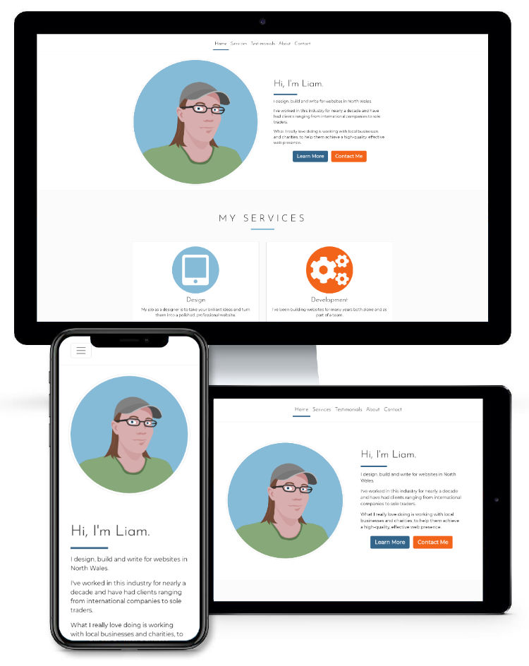
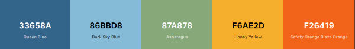
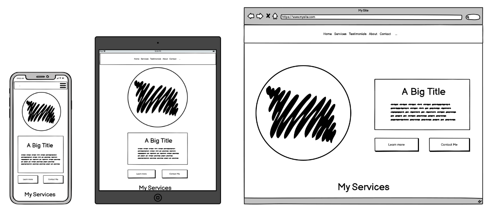

# Freelance Work Profile Website

[Visit the live site here.](https://lmjh.github.io/freelance_work_profile_website/)

The purpose of the site is to provide information about my freelance services to prospective clients and provide contact details to both new and returning customers.

I primarily cater to local businesses, freelancers and charities. My clients are usually looking for a locally-based developer to work with and aren't usually interested in many technical details.

The site is designed to provide easily accessible, relevant information to my target audience. I have used a responsive, mobile-first design to ensure the site is effective and well laid out across a range of devices.



***

## User Experience

Most users of the site will be either prospective new clients or returning clients. 

### New Client User Stories

* As a prospective new client, I want to quickly and easily understand the services on offer so I can decide if they might meet my needs.
* As a prospective new client, I want to learn about the experiences of previous clients so I can determine if the service is reliable.
* As a prospective new client, I want to know how to request more information or hire the freelancer.
* As a prospective new client, I want to quickly be able to understand how to navigate the site to find the information I need.
* As a prospective new client, I want to learn more about the freelancer so I know who I might be working with.

### Returning Client User Stories

* As a returning client, I want to quickly find information on services offered.
* As a returning client, I want to be able to contact the freelancer through my preferred communication method. 

### Design

The overall design of the site is clean and minimalist, to highlight the content and prioritise ease of use.

#### Colour Scheme

* The site employs a limited colour palette, striking a balance between cooler, professional colours and warmer, friendly colours. The palette consists of a dark blue (#33658A), a light blue (#86bbd8), a light green (#87a878), a light orange (#f6ae2d), and a darker orange (#f26419).  

* A colour is associated with each section of the site and used to visually link the navigation bar and the content through coloured underlines of links and section headers. This helps to orient users, establish a feeling of consistency, and provide visual feedback that an action (clicking a coloured link) has had an intended effect (taking the user to the section with the matching colour).
* The darker orange colour was selected to be associated with the Contact section and used for both the navigation bar and call to action button links to that section, because it is the most bold and eye-catching colour in the palette and stands out both against the light background and in contrast to the other colours. 
* Colours are used sparingly so as to maintain the clean look of the site and prevent the page from becoming too visually ‘busy’.

#### Typography

* The site uses clean-looking, attractive fonts that are very easily legible.
* The main font used for the body of the website is [Montserrat](https://fonts.google.com/specimen/Montserrat), a clean, modern-looking sans-serif font that is frequently used in web design because of its attractive appearance and legibility.
* Section headers use [Josefin Sans](https://fonts.google.com/specimen/Josefin+Sans), another popular web font that has clean geometric lines and a few subtle visual flourishes on some characters (such as the capital W), while maintaining high legibility. 
* Uppercase letters with a little extra letter spacing are used for most section headings to provide visual contrast with the body text and subheadings. The exception to this is the home section, which has an informal greeting as a header rather than a standard section title. To maintain the casual, informal feel and contrast with the other sections, lowercase letters are used here.
* The extra letter spacing for the section titles is removed on smaller screens, as it can cause longer section titles (e.g. "Testimonials") to overflow off the screen.
* Both fonts have a fallback set to sans serif, in case the external Google Font fails to load.

#### Imagery

* The home section is intended to serve as a friendly and welcoming introduction, so it is illustrated by a simple vector drawing of myself, to accompany the informal greeting header and the introduction text. To help establish visual consistency, the drawing uses the same limited colour palette as the website for the clothing, eye colour and background.
* Font Awesome icons are used to illustrate the Services section. The icons are set against simple coloured backgrounds, using the website’s colour palette. 
* The testimonial section currently uses fictitious people and quotes, so stock images of people are used to illustrate these and help to establish trust with potential clients. The images selected are intended to represent a range of potential clients: a teacher in front of a whiteboard, a business person in a suit, and a person in front of a colourful, graffitied background, intended to imply creativity. These images would be replaced with real images of actual clients in a final live version of the site.
* An image of a mountain lake in my part of the country is used to illustrate the About section, as decoration and to reinforce the idea that I’m a rurally-based developer. Note that because this image is primarily decorative and used for ambiance, it is not enclosed in a semantic HTML figure element and the alt text attribute is deliberately left blank, in accordance with [W3C accessibility guidance](https://www.w3.org/WAI/tutorials/images/decorative/#image-used-for-ambiance-eye-candy). Blank alt text attributes for these types of images avoids "audible clutter to screen reader output" ([W3C](https://www.w3.org/WAI/tutorials/images/decorative/)).

### Wireframes

The site is responsively designed to adapt to the viewing device.



Full layout wireframes for different sized devices can be viewed here:
* Mobile Full Layout Wireframe - [View](documentation/wireframes/mobile-layout.png)
* Tablet Full Layout Wireframe - [View](documentation/wireframes/tablet-layout.png)
* Desktop Full Layout Wireframe - [View](documentation/wireframes/desktop-layout.png)

***

## Features

### Navigation Bar

* The site uses a sticky navigation bar at the top of the page. This is an array of links that allows site users to quickly navigate to any section of the site.
* The navigation bar is always visible on desktop screens and uses the Bootstrap scrollspy feature to visually update the links with coloured underlining as the user scrolls through the site.
* The navigation bar collapses into a hidden menu on smaller screens in order to make better use of the limited screen space. Users can view or hide the navigation menu by tapping or clicking on the icon at the top of the screen.

### Concise Descriptions of Services

* The site features concise descriptions of the services on offer, presented using Bootstrap’s cards feature and illustrated with Font Awesome icon fonts.
* The clean and simple presentation and concise descriptions are intended to provide users with just enough easily absorbable information about the services, without overwhelming them with technical details or information overload.

### Testimonials from Previous Clients

* The site features a section to display images of and quotes from previous clients, to help establish trust and demonstrate reliability to potential clients. The feature uses Bootstrap’s carousel, which allows for both automatic and manual scrolling of the embedded content.
* The people and quotations are currently fictitious and the section contains stock photographs, for demonstration purposes.

### A Contact Section

* The site has a contact section where users can find details on how to contact the freelancer as well as a simple contact form. 
* The phone number and email address are both clickable and will directly call or email the associated number or address, if the user’s browser is set up to handle this.
* The contact form is designed to be as simple as possible, with just three required fields, and provides visual feedback to the user on successful completion by displaying a confirmation message in a Bootstrap modal. The contact form does not currently send any messages, as that functionality is beyond the scope of this project.

### Responsive Design

* The site is designed to be responsive, which means that the layout and various features and sections adapt and rearrange depending on the size of the user’s viewport. This ensures that the site is well laid out and functional on a wide range of viewing devices, including mobiles, tablets, laptops and desktops.
* The Bootstrap grid system is used extensively to achieve the responsive design, along with CSS media queries. Where possible and appropriate, the site uses relative units such as rem and %.

### Accessibility

* The site uses semantic HTML elements and [ARIA (Accessible Rich Internet Applications)](https://www.w3.org/WAI/standards-guidelines/aria/)  HTML attributes to ensure that it is as accessible as possible for visitors using screen readers or other visitors with additional accessibility needs.  
* The site has been tested for accessibility using Firefox’s accessibility tools, including examining the structure, ensuring navigation menus are accessible, and checking that text has adequate contrast.

***

## Organisation of Content

The site contains relatively few features and doesn't have a large amount of content to accommodate, so a single page with clearly delineated sections and a simple and always-visible navigation bar is a good solution. Although the content could be spread across multiple pages, this would add an unnecessary burden on the user to click between pages to load and view content. Some of the pages would also be quite sparsely populated with content. From an SEO perspective, it's generally considered better to have a single content-rich page than multiple thin pages.

Because the main purpose of the website is to describe and promote my services to prospective clients, content sections are prioritised in the following order:

1. A home screen / hero area with a clear and concise description of the purpose of the site and the services available.
2. A section with further details on the services on offer. This will be more detailed than the hero area, but still concisely written.
3. A section featuring testimonials from previous clients.
4. A section with further details on myself, my experience and my work.
5. A section with contact details and a contact form.

N.B. Although providing contact details is a priority for both the business and the users, the contact details section has been placed at the bottom of the page for the following reasons:

* Providing useful information to new users is a higher priority than providing contact details. Most new prospective clients won't want to contact a freelancer until they have an understanding of the services on offer.
* There is a convention that contact forms are usually placed at the bottom of single-page websites. Many users will expect the form to be positioned there and can quickly scroll to the bottom of the page to find it. I don't see a good reason to break this convention here.
* The low positioning of the form / details will be mitigated by frequently placing buttons linking to the form throughout the other sections. This acts as a call to action and ensures the contact section is always readily accessible.

***

## Technologies

### Languages Used

* HTML5
* CSS3

### Frameworks, Libraries & Applications Used

1. [GitHub](https://github.com/) - Used for version control and deployment through GitHub Pages.
2. [GitPod](https://gitpod.io/) - Used to write all code and test before deploying to GitHub.
3. [Balsamiq](https://balsamiq.com/) - Used to produce design wireframes.
4. [Bootstrap](https://getbootstrap.com/) - Version 4.6 used extensively throughout the project, including the responsive grid, navigation bar, services section cards, testimonial carousel, the form and button styles, and the contact button modal. [Official documentation for Bootstrap 4.6](https://getbootstrap.com/docs/4.6/getting-started/introduction/) was also used extensively for reference.
5. [Affinity Designer](https://affinity.serif.com/en-gb/designer/) - Used to crop, edit and compress images for the site and documentation.
6. [Font Awesome](https://fontawesome.com/) - Used for services section and contact section icons. Installed via [cdnjs](https://cdnjs.com/libraries/font-awesome).
7. [Google Fonts](https://fonts.google.com/) - Used for heading font ([Josefin Sans](https://fonts.google.com/specimen/Josefin+Sans)) and body font ([Montserrat](https://fonts.google.com/specimen/Montserrat)).
8. [coolors](https://coolors.co/) - Used to help design colour scheme. 
9. [Firefox](https://www.mozilla.org/en-GB/firefox/new/) - Firefox dev tools used extensively to test code and check accessibility.
10. [uifaces.co](https://uifaces.co/) - Used to help find appropriate images for testimonial section.
11. [NameFake](https://en.namefake.com/) - Used to generate fake names for testimonial section.
12. [Inkscape](https://inkscape.org/) - Used to draw vector portrait for homepage.
13. [W3C.org](https://www.w3.org/) - W3C [HTML Validator](https://validator.w3.org/nu/) and [CSS Validator](https://jigsaw.w3.org/css-validator/validator) used to check code for errors.
14. [freeformatter.com](https://www.freeformatter.com/) - [HTML formatter](https://www.freeformatter.com/html-formatter.html) and [CSS formatter](https://www.freeformatter.com/css-beautifier.html) used to beautify code.
15. [responsivemockups.com](https://responsivemockups.com/) - Used to generate the mockups of the landing page embedded at the top of this readme.

***

## Testing

Please see [TESTING.md](TESTING.md) for more details of tests performed and bugs fixed.

***

## Deployment

### Deploying to GitHub Pages

The site was deployed to GitHub Pages using the following process:

1. Log in to GitHub.
2. Click the "Repositories" link at the top of the GitHub user dashboard.
3. Locate the [GitHub project repository](https://github.com/lmjh/freelance_work_profile_website) and click its title.
4. On the project page, click the "Settings" link in the options menu at the top of the page.
5. Click the "Pages" link near the bottom of the menu on the Settings page.
6. On the GitHub Pages settings menu, click the dropdown beneath "Source" and select "main".
7. Check that the new dropdown that appears displays "/ (root)" and then click "Save".
8. A confirmation message should appear with a link to the deployed site. Click this link to view the site. (It may take a minute or two for the site to be avaiable.)

### Forking the GitHub Repository

By forking the GitHub Repository we make a copy of the original repository on our GitHub account to view and/or make changes without affecting the original repository by using the following steps...

1. Log in to GitHub and locate the [GitHub Repository](https://github.com/lmjh/freelance_work_profile_website)
2. At the top of the Repository (not top of page) just above the "Settings" Button on the menu, locate the "Fork" Button.
3. You should now have a copy of the original repository in your GitHub account.

### Making a Local Clone

1. Log in to GitHub and locate the [GitHub Repository](https://github.com/lmjh/freelance_work_profile_website)
2. Under the repository name, click "Clone or download".
3. To clone the repository using HTTPS, under "Clone with HTTPS", copy the link.
4. Open Git Bash
5. Change the current working directory to the location where you want the cloned directory to be made.
6. Type `git clone`, and then paste the URL you copied in Step 3.

```
$ git clone https://github.com/lmjh/freelance_work_profile_website
```

7. Press Enter. Your local clone will be created.

```
$ git clone https://github.com/lmjh/freelance_work_profile_website
> Cloning into `CI-Clone`...
> remote: Counting objects: 10, done.
> remote: Compressing objects: 100% (8/8), done.
> remove: Total 10 (delta 1), reused 10 (delta 1)
> Unpacking objects: 100% (10/10), done.
```

Click [Here](https://help.github.com/en/github/creating-cloning-and-archiving-repositories/cloning-a-repository#cloning-a-repository-to-github-desktop) to retrieve pictures for some of the buttons and more detailed explanations of the above process.

***

## Other Credits and Acknowledgements

* [Code Institute](https://codeinstitute.net/) for their useful lessons and reference materials.
* My Code Institute mentor, [Tim Nelson](https://tim.2bn.dev/), for the script to display a Bootstrap modal when the user submits a validated form, and a wealth of other advice and assistance.
* [Pexels](https://www.pexels.com) was used to source images for Testimonials and About sections.
    - About section image: [Lake Surrounded by Mountain, by Lukas Hartman](https://www.pexels.com/photo/lake-surrounded-by-mountain-1462012/)
    - Testimonial image 1: [Woman Standing Near Whiteboard, by Christina Morillo.](https://www.pexels.com/photo/woman-standing-near-whiteboard-1181519/)
    - Testimonial image 2: [Men's Wearing Black Suit Jacket and Pants, by mentatdgt](https://www.pexels.com/photo/men-s-wearing-black-suit-jacket-and-pants-937481/)
    - Testimonial image 3: [Woman Leaning on Teal and Red Wall, by Luis Quintero.](https://www.pexels.com/photo/woman-leaning-on-teal-and-red-wall-1575996/)
* [Code Institute Sample README](https://github.com/Code-Institute-Solutions/SampleREADME/blob/master/README.md) for the structure of this project's documentation and the GitHub forking and cloning processes.