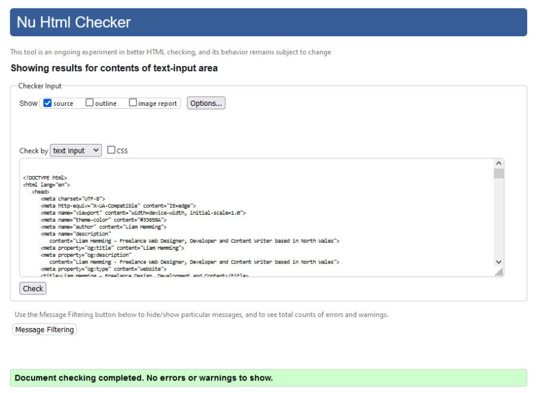

# Testing of Freelance Work Profile Website

## Code Validation

The HTML and CSS code of the project was tested using the W3C [HTML Validator](https://validator.w3.org/nu/) and [CSS Validator](https://jigsaw.w3.org/css-validator/validator) to ensure there were no errors in the syntax. 

### HTML Validation

The HTML validation check was passed with no errors or warnings.

### CSS Validation

The CSS validation check was passed with no errors. 13 warnings were returned for unknown vendor extensions. 12 of the warnings were related to the CSS root variables I added to store the website colours. The 13th was related to the -ms-flex property used to provide flexbox compatibility with Internet Explorer 10. I checked the warnings, but don't consider any of them to be an issue.

***

## Testing User Stories and User Experience Goals

### New Client User Stories

1. As a prospective new client, I want to quickly and easily understand the services on offer so I can decide if they might meet my needs.

    * Visitors to the site are greeted with a short introduction and a very brief outline of the services on offer.
    * The first sentence of the introduction provides a clear statement of the work I do. The following statements provide a little more information, and there is a clear and prominent “Learn More” button on the home screen.
    * Users can either click the “Learn More” button or scroll down to find more information about services offered.
    * The home page is designed not to take up the whole screen height on desktops, so that users on larger screens can see the “My Services” title at the bottom of the screen as an additional pointer to that content.
    * A link to the Services section is also provided in the navigation bar. 
2. As a prospective new client, I want to learn about the experiences of previous clients so I can determine if the service is reliable.

    * Once a user has read about the services on offer, they can continue to scroll down to find quotes from previous clients in the Testimonials section.
    * Users who want to reach the Testimonials section directly can click the navigation bar link, which is always visible at the top of the page.
3. As a prospective new client, I want to know how to request more information or hire the freelancer.

    * “Contact Me” link buttons are positioned in the Home, Services and About section so that users scrolling through the site regularly see direct links to the Contact section. The buttons are styled with the most eye-catching colour in the site’s palette.
    * The Contact section is also linked from the navigation bar, which is always visible at the top of the page.
    * The Contact section is positioned at the bottom of the page, as is usually customary for single page websites. This is an expected layout for some users and allows them to quickly scroll to the bottom of the page to locate the appropriate section.
    * Once users reach the Contact section, they are presented with several options for contact. 
    * Large hyperlinked buttons allow users visiting on phones or with appropriate email clients set up to call or email with a single click. The buttons are labelled with a contact number and email address, so users who cannot use the hyperlinks can still use the relevant details.
    * The Contact form is simply laid out and clearly labelled. It uses a minimum of fields in order to keep things simple for users.
4. As a prospective new client, I want to quickly be able to understand how to navigate the site to find the information I need.

    * A navigation bar is included at the top of the page. This is the most common location for a navigation bar and so most users will be able to quickly find this.
    * Users on larger screens can see the “My Services” title at the bottom of the home screen, which provides a visual clue that simply scrolling down will reveal more content
    * The site uses smooth scrolling so that when navigation bar links are clicked, the viewport scrolls smoothly to the requested section. This gives users a visual clue that all of the content is on the same page and is accessible by simply scrolling .
    * The site uses the Bootstrap scrollspy feature to visually update the navigation bar as the user scrolls through the site sections. This gives users who scroll down when they arrive but don’t use the navigation bar a visual clue that the navigation bar is available as an alternative method of navigation.
5. As a prospective new client, I want to learn more about the freelancer so I know who I might be working with.

    * Users are greeted with a short introduction along with a vector portrait of the freelancer. 
    * By scrolling through the page or using the navigation bar, users can find out more about the freelancer in the About section or by reading Testimonials from previous clients.

### Returning Client User Stories

1. As a returning client, I want to quickly find information on services offered.

    * The Services section is given the top priority after the Home section, so returning clients can quickly scroll to that section to see any updates.
    * A prominent button link to the Services section is also provided in the Home section.
2. As a returning client, I want to be able to contact the freelancer through my preferred communication method.

    * Prominent button links to the Contact section are provided throughout the site in addition to the link located in the navigation bar.
    * Users are presented with different options for contact. They can use the included contact form, or call or email directly using the provided details.

***

## Further Testing

* The site and all links were tested extensively with Firefox, Google Chrome and Microsoft Edge.
* Accessibility testing was done using Firefox Accessibility tools.
* Responsiveness and mobile layouts were tested using Firefox developer tools and by visiting the site on an Android phone and an iPad.
* Friends and family were invited to visit the site using a range of devices and feedback any issues or bugs they encountered.

## Significant Bugs and Issues Discovered and Resolved

### Contrast Issues

Description:  

While checking that the site met accessiblity standards using the Firefox Accessibility tools, I discovered that the navigation bar text and the button text for the Contact sections both had poor contrast. 

Solution:  
This was resolved by applying darker color to the navigation bar and using bold text for the contact buttons.

* Navigation bar before fix:  

* Navigation bar after fix:  

* Contact button before fix:  

* Contact button after fix:  

### Home Navigation Bug

Description:  
Clicking the Home link on the top navigation bar scrolled the page to just above the page heading, rather than the top of the page as expected.

Solution:  
The #home section had a margin-top applied to ensure the content wasn't obscured by the navigation bar. The Home link was scrolling to the bottom of this margin. This was resolved by replacing the margin-top with padding-top.

* Scroll position before fix:  

* Scroll position after fix:  

### Scrollspy Issue

Description:  
Bootstrap scrollspy is used to update the navigation bar as the user navigates the page in order to provide visual feedback to the user. However, by default scrollspy doesn't update the navigation bar until the user has scrolled past the beginning of the linked section. This results in a confusing user experience, as the screen can be almost full of one section while another section is still highlighted in the navigation bar.

Solution:  
Using the scrollspy data-offset attribute instructs scrollspy to update the navigation bar earlier, providing a better user experience. I used a data-offest value of 200 pixels.

* Navigation highlighting before fix:  

* Navigation highlighting after fix:  

### Letter Spacing Issue

Description:  
Section headings have additional letter spacing applied for aesthetic purposes. This caused some section titles to overflow the viewport on smaller screens and become illegible.

Solution:  
This issue was solved by using media queries to only apply the letter spacing style to larger viewports.

* Mobile view section header before fix:  

* Mobile view section header after fix:  

***

## Known Outstanding Bugs and Issues

* The contact form is not currently functional. Implementing a functional contact form is beyond the scope of this project.